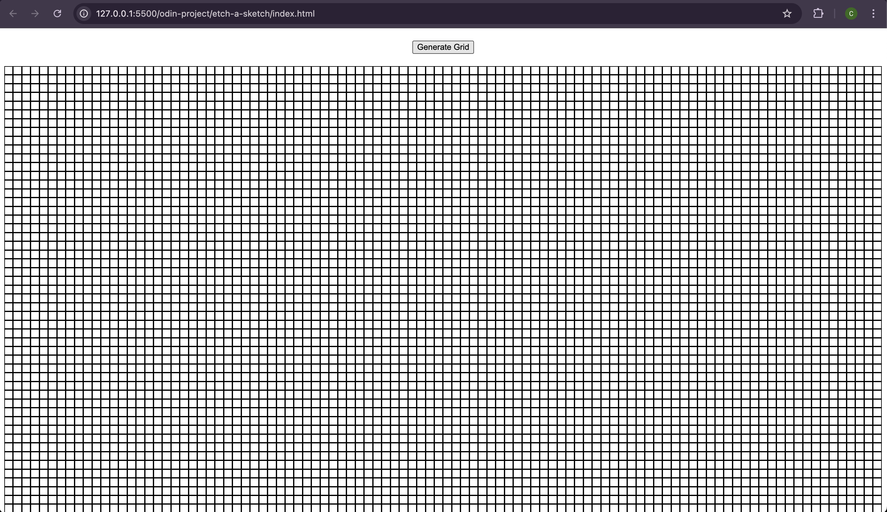

# Etch-a-Sketch

## Context
This project aims to recreate a basic drawing tool using JavaScript, HTML, and CSS, allowing users to draw on a grid with their mouse, simulating the functionality of a classic Etch-a-Sketch toy.

## Skills and Tools Used
### HTML:
- Basic layout elements: `
`, `<button>`

### CSS:
- Basic styling: colors, margins, paddings, borders
- Flexbox for layout alignment

### JavaScript:
- DOM Manipulation: adding, removing, and modifying elements
- Event listeners for interactive elements (mouse events)
- Functions for drawing and resetting the grid

## Features
- **Interactive Drawing Grid:** Users can hover over squares to "draw" by changing their background color.
- **Adjustable Grid Size:** Users can specify the grid size (e.g., 16x16, 32x32) to control the detail of their drawings.
- **Reset Button:** Clears the grid and resets it to a blank state.

## Final Product
Below is a sample screenshot of the Etch-a-Sketch app:

